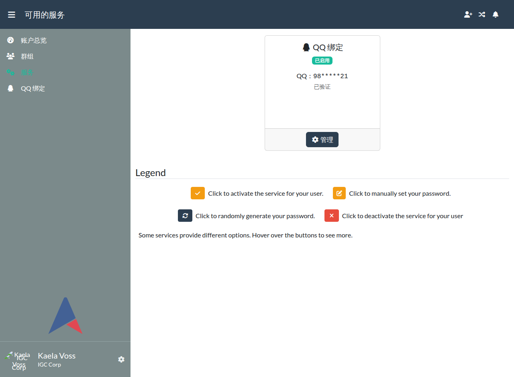
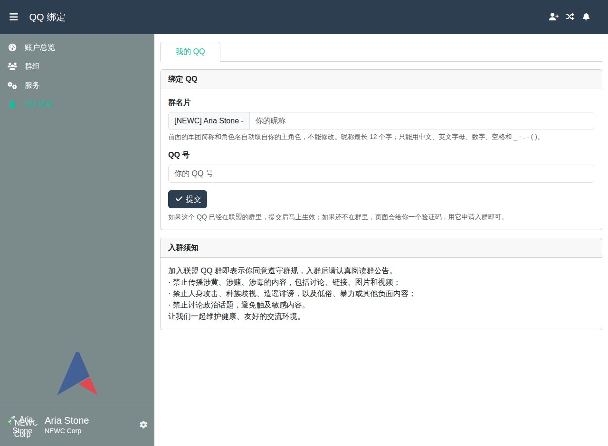
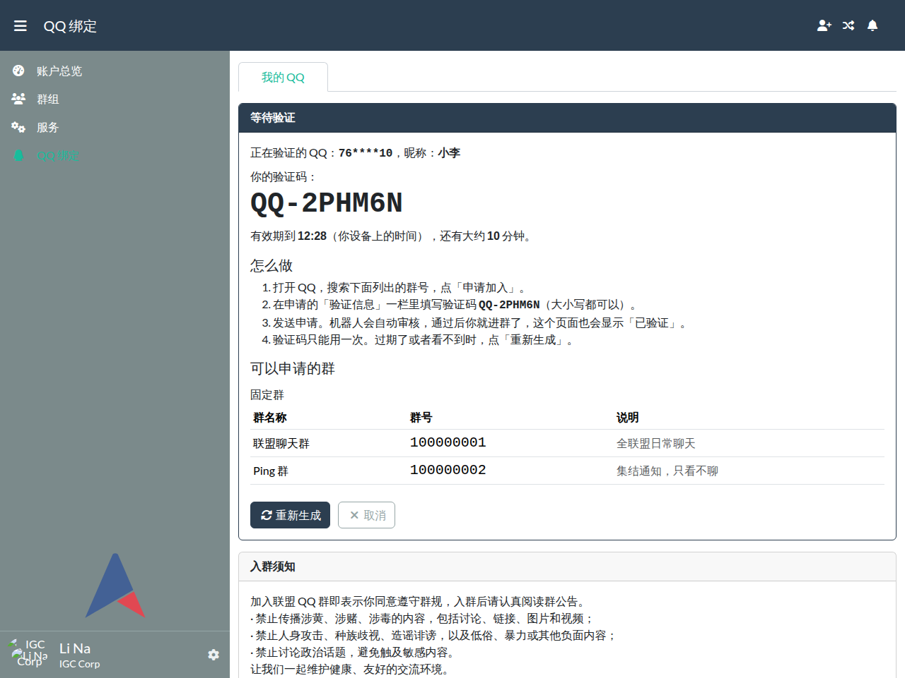
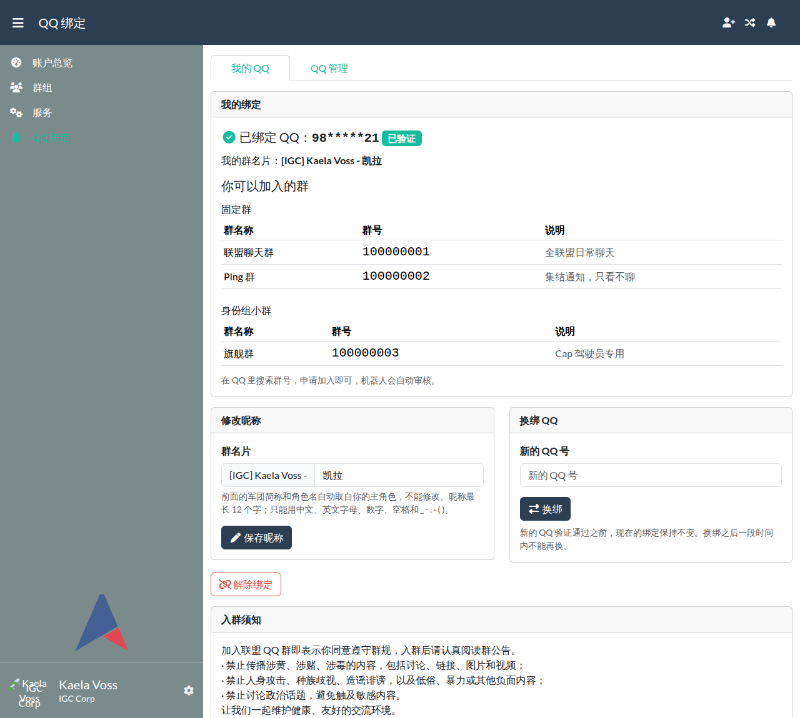
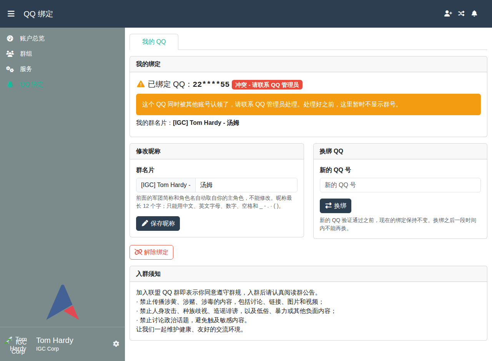
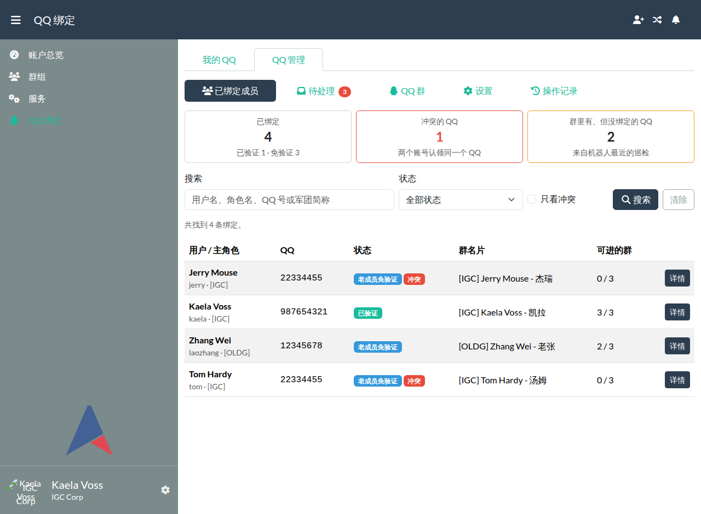
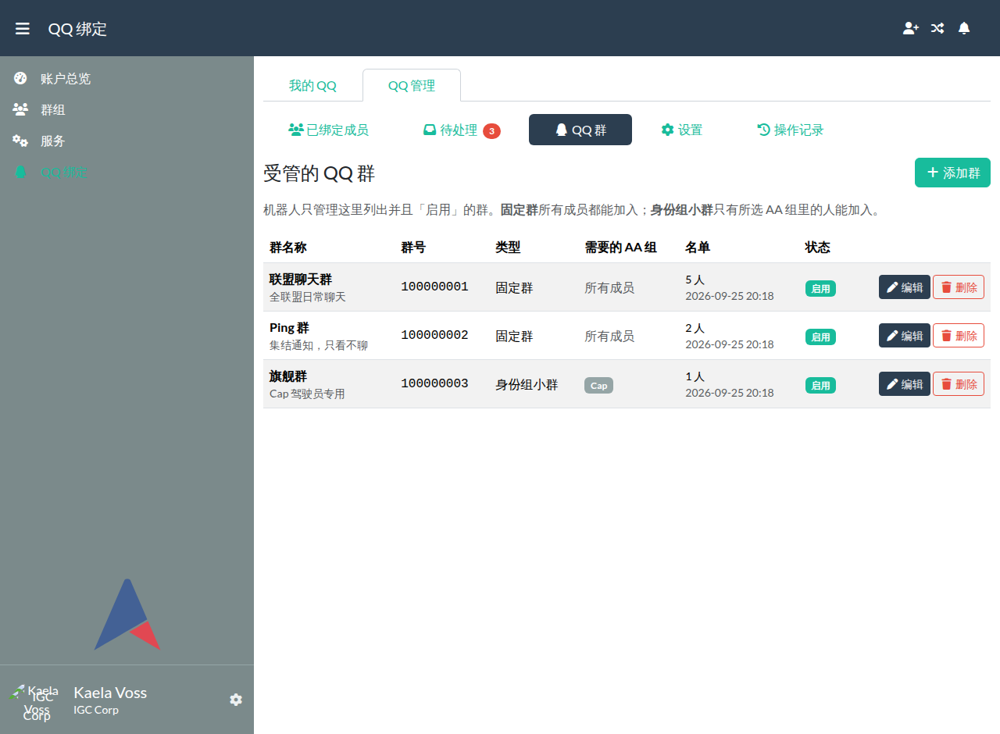
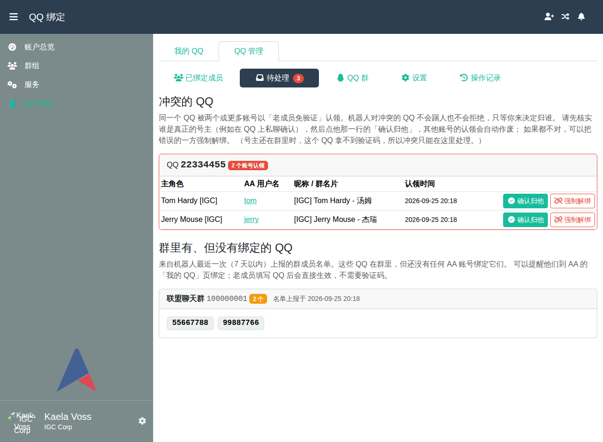
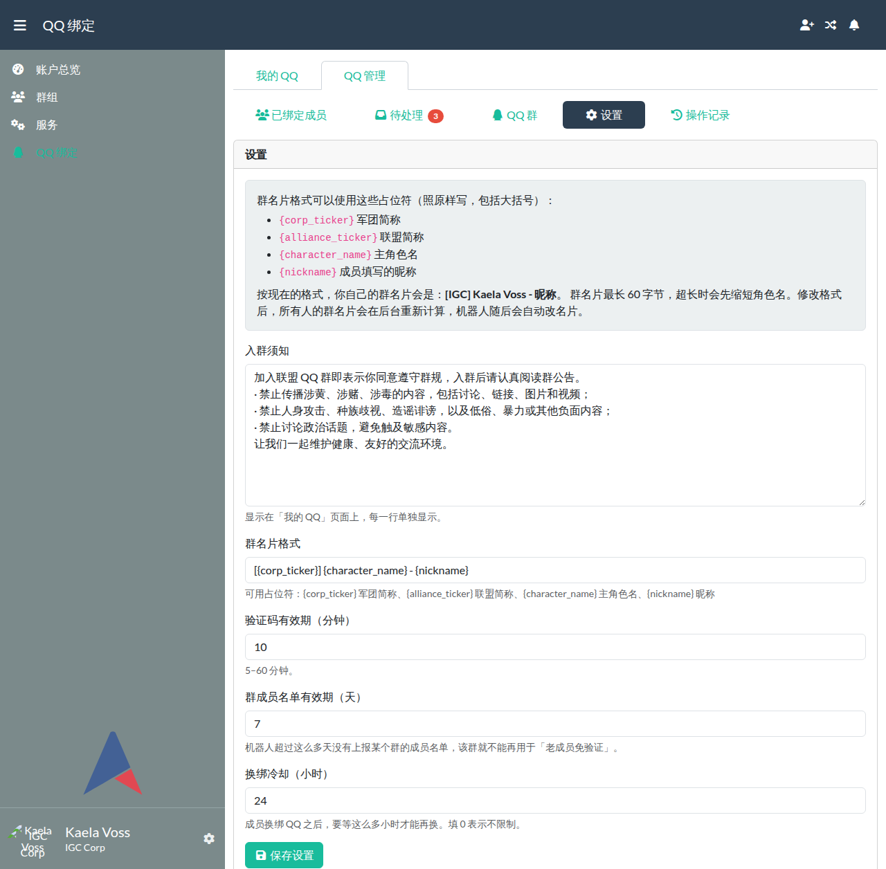

# aa-qqbot

[Alliance Auth](https://gitlab.com/allianceauth/allianceauth)（AA）的 QQ 绑定插件：
**只让 AA 认可的人留在联盟的 QQ 群里。**

- 成员在 AA 里绑定自己的 QQ 号；
- QQ 机器人（Koishi，另一个仓库）来问 AA：「这个 QQ 能不能进这个群？群名片该叫什么？」；
- 成员离开联盟、账号被停用、换了主角色，AA 都会记下来，机器人下次来取时就知道了。

需要 Alliance Auth 5.x（5.2 及以上）、Python 3.10 及以上。

---

## 目录

1. [它能做什么](#1-它能做什么)
2. [安装（给 IT）](#2-安装给-it)
3. [生成机器人密钥](#3-生成机器人密钥)
4. [分配权限](#4-分配权限)
5. [页面在哪里](#5-页面在哪里)
6. [机器人那边怎么接](#6-机器人那边怎么接)
7. [升级](#7-升级)
8. [卸载](#8-卸载)
9. [开发与测试](#9-开发与测试)

---

## 1. 它能做什么

**成员**（有「QQ 绑定 - 成员」权限的人）：

- 在 AA 的「服务」页和左侧菜单里看到「QQ 绑定」；
- 填写自己的 QQ 号和昵称：
  - **已经在群里的老成员**：填完马上生效，不用验证；
  - **新成员**：会拿到一个验证码（例如 `QQ-7KXM2P`），申请入群时把验证码填在「验证信息」里，机器人看到后自动通过；
- 看到自己有资格加入的群；
- 修改昵称、换绑、解绑。

**QQ 管理员**（有「QQ 绑定 - 管理员」权限的人），全部在网页前台完成，不用进 Django 后台：

- 添加、修改、停用 QQ 群，分「固定群」（所有成员都能进）和「身份组小群」（只有指定 AA 组的人能进）；
- 查看所有绑定，修改某人的群名片，确认绑定，强制解绑；
- 处理「冲突」（同一个 QQ 被两个账号认领）和「群里有但没绑定」的 QQ；
- 修改入群须知、群名片格式、验证码有效期等设置；
- 查看操作记录。

**机器人**（Koishi）通过带签名的接口来问 AA，接口说明见 [`API.md`](API.md)。
「真的把人踢出群」这个开关只在机器人那边，AA 网页上开不了，防止误操作。

### 截图（演示数据）

| 服务页卡片 | 绑定前 | 新成员：等待验证 |
|---|---|---|
|  |  |  |

| 已绑定 | 冲突 | 管理：已绑定成员 |
|---|---|---|
|  |  |  |

| 管理：QQ 群 | 管理：待处理 | 管理：设置 |
|---|---|---|
|  |  |  |

截图里的群号、QQ 号和角色都是虚构的演示数据。

---

## 2. 安装（给 IT）

下面的命令都在 AA 服务器上、**AA 的 Python 虚拟环境里**执行（和安装其他 AA 插件一样）。
`myauth` 是 AA 项目目录的常见名字，请换成你们自己的。

### 第 1 步：安装插件

```bash
pip install git+https://github.com/yilifaer/aa-qqbot-plugin.git
```

> 如果 AA 是 **5.2.x**：AA 5.2 没有限制 `django-sri` 的版本，而 `django-sri` 1.0 删掉了 AA 页面要用的 `sri_static` 标签。
> 安装或升级任何包时如果顺带装上了 `django-sri` 1.0，AA 页面会报错。可以用 `pip install "django-sri<1"` 固定版本（AA 5.3 及以上已自带这个限制）。

### 第 2 步：修改 `myauth/myauth/settings/local.py`

在文件**末尾**加上下面这段：

```python
# ---------- aa-qqbot ----------
INSTALLED_APPS += ["qqbot"]

# 机器人接口不走 AA 登录，而是用签名认证，所以要把 qqbot 加进「公开页面」名单。
# 注意：一定要用 +=（追加），不要写成 = （覆盖），否则其他插件的公开页面会失效。
# 如果 local.py 里还没有 APPS_WITH_PUBLIC_VIEWS，就先写一行：APPS_WITH_PUBLIC_VIEWS = []
APPS_WITH_PUBLIC_VIEWS += ["qqbot"]

# 机器人通信密钥：{"密钥名": "密钥"}。生成方法见本文第 3 节。
# 密钥名只能用英文字母、数字和 - _ . 等符号（不能有空格、不能用中文，最长 64 个字符），例如 "koishi-1"。
# 可以同时写多把，每把都有效，方便不停机更换（见第 3 节）。
QQBOT_API_KEYS = {
    "koishi-1": "这里换成生成的密钥",
}

# 每天自动对账一次（重新检查所有人的资格和群名片，并清理旧数据）。
# local.py 开头一般已经有 from .base import *，crontab 可以直接用；
# 如果提示找不到 crontab，再加一行：from celery.schedules import crontab
CELERYBEAT_SCHEDULE["qqbot_reconcile"] = {
    "task": "qqbot.tasks.reconcile",
    "schedule": crontab(minute="17", hour="4"),  # 每天 04:17
}
# ---------- aa-qqbot 结束 ----------
```

> ⚠️ 再强调一次：`APPS_WITH_PUBLIC_VIEWS` 要**追加**。如果漏了这一步，机器人的请求会被当成
> 「没登录」跳转到登录页，机器人就无法工作；第 5 步的检查会直接报出来。

### 第 3 步：建立数据表

```bash
python manage.py migrate
```

本插件没有自己的静态文件，但顺手跑一下也无妨：`python manage.py collectstatic --noinput`。

### 第 4 步：重启 AA

按你们平时的方式重启网页进程（gunicorn）和后台任务进程（celery worker、celery beat）。
用 supervisor 的常见写法：

```bash
sudo supervisorctl restart myauth:
```

如果 AA 是用 Docker 装的，请按你们的方式重建并重启容器。

### 第 5 步：检查配置

```bash
python manage.py check
```

插件自带检查，配置有问题会直接显示出来：

| 代码 | 意思 | 怎么改 |
|---|---|---|
| `qqbot.E001` | `APPS_WITH_PUBLIC_VIEWS` 里没有 `"qqbot"` | 按第 2 步**追加** |
| `qqbot.E002` | 没配 `QQBOT_API_KEYS`，或者格式不是 `{...}` 字典 | 按第 2 步配置 |
| `qqbot.E003` | 有密钥太短（少于 32 个字符） | 按第 3 节重新生成 |
| `qqbot.E004` | 有密钥名格式不对（有空格、中文，或超过 64 个字符），机器人用它发的请求会一直被拒绝 | 改成 `koishi-1` 这样的英文名字，机器人那边同步修改 |
| `qqbot.W001` | 缓存不是 Redis 这类多进程共享的缓存 | AA 默认就是 Redis，检查 `local.py` 有没有改过 `CACHES` |

没有出现 `qqbot.` 开头的提示，就说明配置好了。

---

## 3. 生成机器人密钥

在**你自己的电脑**上（装了 Python 就行）运行：

```bash
python -c "import secrets; print(secrets.token_urlsafe(48))"
```

会打印一串 64 个字符左右的随机字符。把它：

1. 交给 IT，写进 AA 的 `QQBOT_API_KEYS`；
2. 同样写进机器人（Koishi）的配置里，密钥名也要一致。

注意：

- 密钥**不要**发到群里、不要提交到任何仓库，也不要写进 AA 的网页设置里；
- **不停机换密钥**：先在 `QQBOT_API_KEYS` 里**加上**新密钥（旧的先留着）→ 重启 AA → 机器人改用新密钥 →
  确认机器人正常后，再把旧密钥删掉并重启 AA。例如过渡期间：

  ```python
  QQBOT_API_KEYS = {
      "koishi-1": "旧密钥",
      "koishi-2": "新密钥",
  }
  ```

---

## 4. 分配权限

插件有两个权限，都在 Django 后台（`/admin/`）里挂到**状态（State）**或**组（Group）**上：

| 权限 | 在后台里显示为 | 建议挂给 |
|---|---|---|
| `qqbot.basic_access` | `QQ 绑定 \| general \| QQ 绑定 - 成员：可以绑定自己的 QQ` | **Member 状态** |
| `qqbot.manage` | `QQ 绑定 \| general \| QQ 绑定 - 管理员：可以在前台管理 QQ 群与绑定` | 新建一个组，例如「QQ 管理」，把管理员加进去 |

操作步骤：

1. **成员权限**：后台 →「States」→ 点开 **Member** → 在「Permissions」的搜索框里输入
   `QQ 绑定 - 成员`，选中后点箭头移到右边 → 保存。
2. **管理员权限**：后台 →「Groups」→ 新建或点开「QQ 管理」组 → 在「Permissions」的搜索框里输入
   `QQ 绑定 - 管理员`，移到右边 → 保存。然后把 QQ 管理员加进这个组（在 AA 的组管理里或后台用户页都可以）。

说明：

- 以后想让盟友、外交官也能进群，只要在后台把 `basic_access` 再挂到对应的状态或组上，不用改代码。
- **超级管理员**虽然能看到所有页面，但判断「能不能进群」时**不会**因为是超级管理员就自动放行，
  和普通人一样要真的被授予 `basic_access`。
- 被停用的账号、没有主角色的账号一律不能进群。

---

## 5. 页面在哪里

| 页面 | 地址 | 谁能看 |
|---|---|---|
| 我的 QQ（绑定、换绑、解绑） | 左侧菜单「QQ 绑定」，或「服务」页里的 QQ 卡片，地址 `/qqbot/` | 成员 |
| QQ 管理（群、已绑定成员、待处理、设置、操作记录） | 在「QQ 绑定」页顶部点「QQ 管理」标签，地址 `/qqbot/manage/`。只有管理员权限、没有成员权限的人（例如不在 Member 状态的管理员），点左侧菜单「QQ 绑定」会直接进入这里 | QQ 管理员 |
| Django 后台 | `/admin/` 里的「QQ 绑定」 | 超级管理员（绑定和操作记录在后台只能看不能改，改动请走前台） |

装好之后的第一件事：QQ 管理员打开「QQ 管理」→「QQ 群」，把要管理的群一个个加进去。

需要立刻重新对账（比如刚改了很多权限）时，可以在服务器上手动运行：

```bash
python manage.py qqbot_reconcile
```

---

## 6. 机器人那边怎么接

机器人（Koishi 插件）在另一个仓库。两边怎么通信、签名怎么算、每个接口的字段、错误码，以及
Koishi 端必须注意的事项，都写在本仓库的 [`API.md`](API.md) 里。

---

## 7. 升级

```bash
pip install -U git+https://github.com/yilifaer/aa-qqbot-plugin.git
python manage.py migrate
python manage.py check
sudo supervisorctl restart myauth:
```

升级前建议先备份数据库；升级说明如果提到新的设置项，按说明加进 `local.py`。

---

## 8. 卸载

顺序很重要：**先删数据表，再从 `INSTALLED_APPS` 里去掉。**

```bash
# 1. 删除本插件的所有数据表（绑定、群配置、操作记录都会被删除，请先备份）
python manage.py migrate qqbot zero
```

2. 从 `local.py` 里删掉第 2 步加的整段（`INSTALLED_APPS`、`APPS_WITH_PUBLIC_VIEWS`、
   `QQBOT_API_KEYS`、`CELERYBEAT_SCHEDULE["qqbot_reconcile"]`）。
3. 删掉数据库里的定时任务。AA 5 的 celery beat 会把 `CELERYBEAT_SCHEDULE` 抄进数据库，
   只从 `local.py` 删掉并不会让它停下，以后每天仍会发出 `qqbot.tasks.reconcile`，worker 日志里会一直报
   「unregistered task」。在后台 `/admin/` →「Periodic tasks」里删掉名为 `qqbot_reconcile` 的任务，或者运行：

```bash
python manage.py shell -c "from django_celery_beat.models import PeriodicTask; print(PeriodicTask.objects.filter(name='qqbot_reconcile').delete())"
```

4. 卸载并重启：

```bash
pip uninstall aa-qqbot
sudo supervisorctl restart myauth:
```

记得同时停掉机器人那边的插件。

---

## 9. 开发与测试

需要：Python 3.10+、本机运行的 Redis（测试默认用 Redis 的第 15 号库）。

```bash
git clone https://github.com/yilifaer/aa-qqbot-plugin.git
cd aa-qqbot-plugin
python -m venv .venv && . .venv/bin/activate
pip install "allianceauth>=5.2,<6"   # 需要先装好 MySQL 客户端头文件，例如
                                     # apt install default-libmysqlclient-dev build-essential pkg-config
redis-server --daemonize yes         # 如果还没运行 Redis
python manage.py test qqbot
```

- 测试设置在 `testauth/settings.py`，默认用 SQLite。
- 换 Redis 地址：`QQBOT_TEST_REDIS=redis://127.0.0.1:6379/5 python manage.py test qqbot`。
- 用 MariaDB/MySQL 或 PostgreSQL 跑（并发测试 `qqbot/tests/test_core_concurrency.py` 只在这两种数据库上运行）：
  `QQBOT_TEST_DB=mysql`（或 `postgres`），连接信息用 `QQBOT_DB_HOST`、`QQBOT_DB_PORT`、`QQBOT_DB_USER`、
  `QQBOT_DB_PASSWORD`、`QQBOT_DB_NAME` 指定。PostgreSQL 还需要 `pip install "psycopg[binary]"`。
- 完整矩阵用 [tox](https://tox.wiki/)：`tox`（或 `tox -e py312-aa5`、`tox -e py-aa5-mysql`）；
  GitHub Actions 的配置在 `.github/workflows/tests.yml`。
- 提交前请确认：`python manage.py makemigrations qqbot --check --dry-run` 没有新迁移，
  `python -m pyflakes qqbot` 没有报错。

开发文档：[`DESIGN.md`](DESIGN.md)（给所有者看的设计）、[`docs/SPEC.md`](docs/SPEC.md)（实现规格）、
[`DECISIONS.md`](DECISIONS.md)（决定记录）。

---

## License

MIT，见 [LICENSE](LICENSE)。
