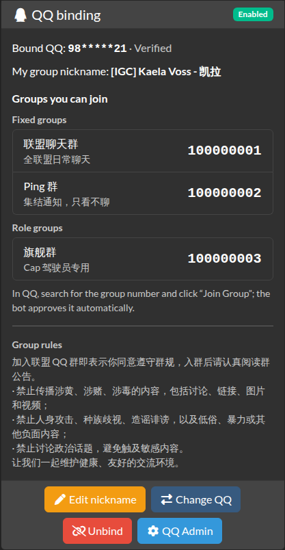

# aa-qqbot

English | [简体中文](README.zh-CN.md)

A QQ group membership plugin for Alliance Auth. Members bind their QQ number on AA's Services page. A QQ bot (Koishi, a separate project) asks AA's API who may join and stay in each group.

- Members already in a group: enter your QQ number, no code needed
- New members: get a one-time code and put it in the QQ join request
- QQ managers handle groups, bindings and conflicts on the "QQ Admin" page in the sidebar



## Requirements

- Alliance Auth 5.x (5.2 or later)
- Python 3.10+

## Installation

Run everything inside AA's virtual environment, in the `myauth` directory.

1. Install the plugin:

```bash
pip install git+https://github.com/yilifaer/aa-qqbot-plugin.git
```

2. Generate a secret for the bot. Keep the output; you need it in the next step and for the bot:

```bash
python -c "import secrets; print(secrets.token_urlsafe(48))"
```

3. Add this to the end of `local.py`, and replace `your-secret` with the secret from step 2:

```python
from celery.schedules import crontab

INSTALLED_APPS += ["qqbot"]
APPS_WITH_PUBLIC_VIEWS += ["qqbot"]  # required by the bot API; append, do not overwrite

QQBOT_API_KEYS = {
    "koishi-1": "your-secret",
}

CELERYBEAT_SCHEDULE["qqbot_reconcile"] = {
    "task": "qqbot.tasks.reconcile",
    "schedule": crontab(minute="17", hour="4"),
}
```

4. Check the configuration, then migrate:

```bash
python manage.py check
python manage.py migrate
```

The configuration is fine when `check` prints no messages starting with `qqbot.`.

5. Restart AA:

```bash
sudo supervisorctl restart myauth:
```

6. In the Django admin, give the two permissions. The picker box is narrow, so search for each one separately:
   - Search `QQ binding: member` and add it to the Member state (codename `qqbot.basic_access`).
   - Create a group for your QQ managers (e.g. "QQ Managers"), search `QQ binding: manager` and add it to that group (codename `qqbot.manage`), then add the manager accounts to the group under Users.

After step 6, members see a card titled "QQ binding" on the Services page. QQ managers get a "QQ Admin" entry in the sidebar, where they add the QQ groups to manage.

## Upgrade

```bash
pip install --upgrade --force-reinstall --no-deps git+https://github.com/yilifaer/aa-qqbot-plugin.git
python manage.py migrate
```

Then restart AA. See [CHANGELOG.md](CHANGELOG.md) for what changed.

## Uninstall

Stop AA, then run (this deletes all bindings and the audit log):

```bash
python manage.py migrate qqbot zero
python manage.py shell -c "from django_celery_beat.models import PeriodicTask; PeriodicTask.objects.filter(name='qqbot_reconcile').delete()"
```

Remove the lines you added to `local.py`, then:

```bash
pip uninstall aa-qqbot
python manage.py remove_stale_contenttypes --include-stale-apps
```

Start AA.

## More

- Bot integration: [API.md](API.md); read [KOISHI_START.md](KOISHI_START.md) before writing the Koishi plugin (both in Chinese). The bot needs the API URL (`https://your-aa-site/qqbot/api/v1/`), the key id and the secret.
- Step-by-step guide and troubleshooting (Chinese): [docs/GUIDE.md](docs/GUIDE.md)
- If this site ran 0.x of this plugin: before step 3, remove the old `"qqbot"`, `QQBOT_GROUP_CHAT` and `QQBOT_PING_GROUP` from `local.py`. Old bindings are not imported; everyone binds again.
- `NameError: name 'APPS_WITH_PUBLIC_VIEWS' is not defined`: your `local.py` is older than the AA 5 template. Add this line above the block from step 3:
  ```python
  APPS_WITH_PUBLIC_VIEWS = []
  ```
- On AA 5.2/5.3, if every page fails with an error mentioning `sri_static`, run this and restart:
  ```bash
  pip install "django-sri<1"
  ```
- Superusers do not get group access automatically. Test with a normal member account.
- Language: the QQ binding card and the QQ Admin pages are in Chinese for users whose AA language is Chinese, and in English for everyone else. Members who never picked a language get their browser's language; anyone can pick a language in AA's language menu (AA remembers it). The default group rules text is in Chinese; edit it under QQ Admin → Settings.

## License

MIT
