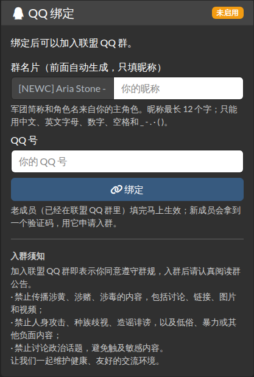
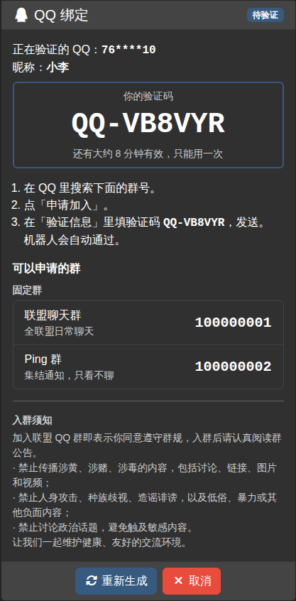
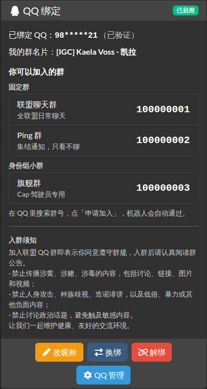
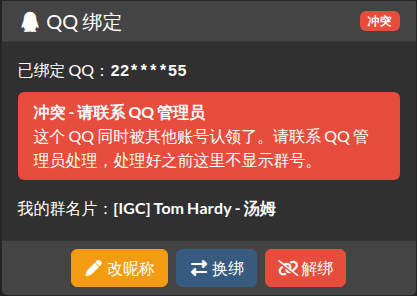

# aa-qqbot 分步安装说明

> 简版安装步骤见 [README](../README.zh-CN.md)。这里是给第一次安装的人看的分步说明，以及常见问题。

[Alliance Auth](https://gitlab.com/allianceauth/allianceauth)（AA）的 QQ 绑定插件：
**只让 AA 认可的人留在联盟的 QQ 群里。**

- 成员在 AA 里绑定自己的 QQ 号；
- QQ 机器人（Koishi，另一个仓库）来问 AA：「这个 QQ 能不能进这个群？群名片该叫什么？」；
- 成员离开联盟、账号被停用、换了主角色，AA 都会记下来，机器人下次来取时就知道了。

当前版本：**1.0.0b3**（测试版），更新内容见 [`CHANGELOG.md`](../CHANGELOG.md)。
需要 Alliance Auth 5.x（5.2 及以上）、Python 3.10 及以上。

---

## 目录

1. [它能做什么](#1-它能做什么)
2. [安装（给 IT）](#2-安装给-it)
3. [机器人密钥：更换与保管](#3-机器人密钥更换与保管)
4. [分配权限](#4-分配权限)
5. [页面在哪里](#5-页面在哪里)
6. [机器人那边怎么接](#6-机器人那边怎么接)
7. [升级](#7-升级)
8. [卸载](#8-卸载)
9. [常见问题](#9-常见问题)
10. [安全须知](#10-安全须知)
11. [开发与测试](#11-开发与测试)

装好以后在树莓派测试 AA 上逐项点一遍：[`docs/TESTING.md`（树莓派测试清单）](TESTING.md)。

---

## 1. 它能做什么

**成员**（有「QQ 绑定 - 成员」权限的人）：

- 所有操作都在 AA「服务（Services）」页的「QQ 绑定」卡片里完成，不用去别的页面；
- 填写自己的 QQ 号和昵称：
  - **已经在群里的老成员**：填完马上生效，不用验证；
  - **新成员**：会拿到一个验证码（例如 `QQ-7KXM2P`），申请入群时把验证码填在「验证信息」里，机器人看到后自动通过；
- 看到自己有资格加入的群；
- 在卡片里修改昵称、换绑、解绑（点卡片底部的按钮，就地展开小表单）。

**QQ 管理员**（有「QQ 绑定 - 管理员」权限的人）在左侧菜单多一个「QQ 管理」，全部在网页前台完成，不用进 Django 后台：

- 添加、修改、停用 QQ 群，分「固定群」（所有成员都能进）和「身份组小群」（只有指定 AA 组的人能进）；
- 查看所有绑定，修改某人的群名片，确认绑定，强制解绑；
- 处理「冲突」（同一个 QQ 被两个账号认领）和「群里有但没绑定」的 QQ；
- 修改入群须知、群名片格式、验证码有效期、群成员名单有效期、换绑冷却等设置；
- 查看操作记录。

**机器人**（Koishi）通过带签名的接口来问 AA，接口说明见 [`API.md`](../API.md)。
「真的把人踢出群」这个开关只在机器人那边，AA 网页上开不了，防止误操作。

> AA 默认是英文界面，左侧菜单显示为「Services」。可以在左侧菜单底部的语言选择里切换成简体中文。
> QQ 绑定卡片和「QQ 管理」页面本身始终是中文。

### 截图（演示数据）

| 服务页里的 QQ 绑定卡片 | 卡片：绑定前 | 卡片：新成员等待验证 |
|---|---|---|
|  |  |  |

| 卡片：已绑定 | 卡片：冲突 | 管理：已绑定成员 |
|---|---|---|
|  |  |  |

| 管理：QQ 群 | 管理：待处理 | 管理：设置 |
|---|---|---|
|  |  |  |

深色主题（Darkly）下的卡片：

| 未绑定 | 等待验证 | 已绑定（管理员） | 冲突 |
|---|---|---|---|
|  |  |  |  |

全部截图在 [`docs/screenshots/`](screenshots/)（浅色和深色主题的卡片在 [`docs/screenshots/cards/`](screenshots/cards/)）。
截图里的群号、QQ 号和角色都是虚构的演示数据。

---

## 2. 安装（给 IT）

下面以 **AA 官方安装文档的默认目录**为例：

| 项目 | 官方默认值 | 你们的（不一样就换掉） |
|---|---|---|
| 运行 AA 的 Linux 用户 | `allianceserver` | |
| Python 虚拟环境 | `/home/allianceserver/venv/auth` | |
| AA 项目目录（`manage.py` 所在的目录） | `/home/allianceserver/myauth` | |
| 配置文件 | `/home/allianceserver/myauth/myauth/settings/local.py` | |
| supervisor 里 AA 的进程组 | `myauth` | |

用 Docker 安装的 AA 见本节末尾。

### 准备

- 一个已经能正常使用的 **Alliance Auth 5.2 或更高的 5.x**；Redis、celery worker 和 celery beat 都在正常运行。
- 服务器上要有 `git`：运行 `git --version`，如果提示找不到，用有 sudo 权限的账号执行 `sudo apt install git`。
- **不需要**额外安装其他 apt 软件包：本插件只依赖 AA 本身（`mysqlclient` 等在安装 AA 时已经装好）。
- **先备份数据库。** 官方安装方式用的是 MariaDB/MySQL，例如（数据库名、用户名以 `local.py` 里 `DATABASES` 的写法为准）：

  ```bash
  mysqldump -u allianceserver -p alliance_auth > ~/aa-backup-$(date +%F).sql
  ```

### 第 0 步：进入 AA 的虚拟环境，确认版本

用 SSH 登录服务器后运行：

```bash
sudo su allianceserver
source /home/allianceserver/venv/auth/bin/activate
cd /home/allianceserver/myauth
```

命令行开头出现 `(auth)` 就说明已经进入虚拟环境。**第 1–5 步的 `pip` 和 `python manage.py …` 都在这里执行。**
`sudo supervisorctl …` 需要有 sudo 权限的账号（`allianceserver` 一般没有），到第 6 步时先输入 `exit` 退回原来的账号再执行。

确认 AA 的版本：

```bash
pip show allianceauth django-sri aa-qqbot | grep -E '^(Name|Version)'
```

（没装过本插件时会多一行 `WARNING: Package(s) not found: aa-qqbot`，这是正常的。）

- `allianceauth` 必须是 **5.2 或以上的 5.x**。如果是 4.x（或 5.0、5.1），**先不要装本插件**：
  pip 会顺带把整个 AA 升级到最新的 5.x，而 AA 的大版本升级有自己的步骤。请先按 AA 官方文档升级 AA。
- 如果 `allianceauth` 是 5.2.x 或 5.3.x，而 `django-sri` 是 `1.x`，先运行 `pip install "django-sri<1"`（原因见[常见问题](#9-常见问题)）。
- 如果显示了 `aa-qqbot`、版本是 **0.x**（例如 `0.2.0`）：这台 AA 装过本仓库的旧版（只有 QQ 号 + 昵称的那个版本）。
  可以直接往下装，新版会建立自己的数据表；旧版的绑定数据不会被导入（决定 #5），全员重新绑定。
  **第 3 步之前**，先把 `local.py` 里旧版加的内容删掉：`INSTALLED_APPS` 里的 `"qqbot"`（否则会报
  `Application labels aren't unique, duplicates: qqbot`），以及 `QQBOT_GROUP_CHAT`、`QQBOT_PING_GROUP` 两行。
  装好后再按[常见问题](#9-常见问题)里「以前装过旧版」一行清理旧权限和旧表。

### 第 1 步：安装插件

```bash
pip install git+https://github.com/yilifaer/aa-qqbot-plugin.git
```

- 最后一行出现 `Successfully installed aa-qqbot-1.0.0b3` 就装好了（可能还会列出其他包，是 AA 缺的依赖）。
- 提示 `Cannot find command 'git'`：先安装 git（见「准备」），或者改用不需要 git 的写法：
  `pip install https://github.com/yilifaer/aa-qqbot-plugin/archive/refs/heads/main.zip`
- 注意：包名是 `aa-qqbot`，只能用上面的 GitHub 地址安装。**不要**运行 `pip install qqbot`：
  PyPI 上的 `qqbot` 是另一个无关的项目，会覆盖本插件的代码。

### 第 2 步：生成机器人密钥

在服务器上（虚拟环境里）或你自己的电脑上运行：

```bash
python -c "import secrets; print(secrets.token_urlsafe(48))"
```

会打印一串 **64 个字符**的随机字符（Windows 上如果提示找不到 python，把 `python` 换成 `py`）。
下一步把它填进 `local.py`，替换掉「这里换成生成的密钥」。同一把密钥之后还要交给机器人那边（第 6 节）。
**不要**把它发到群里、聊天记录、截图或任何仓库里。

### 第 3 步：修改 `local.py`

用编辑器打开配置文件，例如：

```bash
nano /home/allianceserver/myauth/myauth/settings/local.py
```

在文件**最末尾**粘贴下面这段（nano 里按 Ctrl+O、回车保存，再按 Ctrl+X 退出）：

```python
# ---------- aa-qqbot ----------
INSTALLED_APPS += ["qqbot"]

# 机器人接口不走 AA 登录，而是用签名认证，所以要把 qqbot 加进「公开页面」名单。
# 注意：一定要用 +=（追加），不要写成 = （覆盖），否则其他插件的公开页面会失效。
# 如果 local.py 里还没有 APPS_WITH_PUBLIC_VIEWS，就先写一行：APPS_WITH_PUBLIC_VIEWS = []
APPS_WITH_PUBLIC_VIEWS += ["qqbot"]

# 机器人通信密钥：{"密钥编号": "密钥"}。密钥用第 2 步生成的那一串。
# 密钥编号只能用英文字母、数字和 - _ . 等符号（不能有空格、不能用中文，最长 64 个字符），例如 "koishi-1"。
# 可以同时写多把，每把都有效，方便不停机更换（见第 3 节）。
QQBOT_API_KEYS = {
    "koishi-1": "这里换成生成的密钥",
}

# 每天自动对账一次（重新检查所有人的资格和群名片，并清理旧数据）。
# local.py 开头一般已经有 from .base import *，crontab 可以直接用；
# 如果提示找不到 crontab，再加一行：from celery.schedules import crontab
CELERYBEAT_SCHEDULE["qqbot_reconcile"] = {
    "task": "qqbot.tasks.reconcile",
    "schedule": crontab(minute="17", hour="4"),  # 每天 04:17（UTC 时间，即北京时间 12:17）
}
# ---------- aa-qqbot 结束 ----------
```

> ⚠️ 再强调一次：`APPS_WITH_PUBLIC_VIEWS` 要**追加**。如果漏了这一步，机器人的请求会被当成
> 「没登录」跳转到登录页，机器人就无法工作；第 4 步的检查会直接报出来。

可选设置（一般不用改；要改就写在上面那段里）：

| 设置 | 默认值 | 说明 |
|---|---|---|
| `QQBOT_API_RATE_LIMIT` | `120` | 每个密钥每分钟最多请求多少次；`0` 表示不限制 |
| `QQBOT_API_MAX_SKEW` | `300` | 机器人和 AA 的时间最多可以差多少秒 |
| `QQBOT_API_MAX_BODY` | `262144` | 一次请求最大多少字节（256 KB） |

### 第 4 步：检查配置

```bash
python manage.py check
```

只看 `qqbot.` 开头的提示。输出里可能还有 AA 自己或其他插件的提示（例如 `allianceauth.checks.A002` 提醒升级 Redis），
和本插件无关。**没有 `qqbot.` 开头的提示，就说明配置好了。**

有 `qqbot.E…` 错误时，`migrate` 等命令也会拒绝运行（报 `SystemCheckError`），请先按下表改好 `local.py`，再重新运行 `check`：

| 代码 | 意思 | 怎么改 |
|---|---|---|
| `qqbot.E001` | `APPS_WITH_PUBLIC_VIEWS` 里没有 `"qqbot"` | 按第 3 步**追加** |
| `qqbot.E002` | 没配 `QQBOT_API_KEYS`，或者格式不是 `{...}` 字典 | 按第 3 步配置 |
| `qqbot.E003` | 有密钥太短（少于 32 个字符）。最常见的原因：忘了把「这里换成生成的密钥」换成真正的密钥 | 填入第 2 步生成的密钥 |
| `qqbot.E004` | 有密钥编号格式不对（有空格、中文，或超过 64 个字符），机器人用它发的请求会一直被拒绝 | 改成 `koishi-1` 这样的英文名字，机器人那边同步修改 |
| `qqbot.W001` | 缓存不是 Redis 这类多进程共享的缓存。AA 本身就要求 Redis 缓存，所以基本不会出现 | 检查 `local.py` 有没有改过 `CACHES` |
| `qqbot.W002` | `CELERYBEAT_SCHEDULE` 里没有每日对账任务，每日对账不会自动运行 | 按第 3 步加上 `CELERYBEAT_SCHEDULE["qqbot_reconcile"]` 那几行。如果是在后台「Periodic tasks」里手动添加的，可以忽略 |

### 第 5 步：建立数据表

```bash
python manage.py migrate
python manage.py collectstatic --noinput
```

`migrate` 的输出里应该有 `Applying qqbot.0001_v1_initial... OK`。
本插件没有自己的静态文件，`collectstatic` 只是按 AA 插件的惯例顺手跑一下。

### 第 6 步：重启 AA

```bash
exit                                  # 退回有 sudo 权限的账号
sudo supervisorctl restart myauth:
sudo supervisorctl status             # 每一行都应该是 RUNNING
```

`myauth:` 这个组里一般有 celery worker、celery beat，也可能有 gunicorn。看 `status` 的输出：
如果 gunicorn（网页进程）是单独的一行、名字不以 `myauth:` 开头，还要单独重启它，例如 `sudo supervisorctl restart gunicorn`
（名字以 `status` 里显示的为准）。

### 第 7 步：确认装好了

1. 在第 0 步的虚拟环境里运行 `python manage.py check`，没有 `qqbot.` 开头的提示。
2. 在任何能访问 AA 的电脑上运行（把网址换成你们的 AA 网址）：

   ```bash
   curl -i -X POST https://auth.example.com/qqbot/api/v1/health/
   ```

   第一行里有 `401`，最后一行是 `{"ok": false, "error": "missing_headers", …}` → **正常**（没签名当然被拒绝）。
   - 看到 `302` 或一个登录网页 → `APPS_WITH_PUBLIC_VIEWS` 没加好（`qqbot.E001`）；
   - 看到 `400` 网页 → 用的地址不在 `ALLOWED_HOSTS` 里（见[常见问题](#9-常见问题)）；
   - 看到 `404` 网页 → 插件没装上或 AA 没重启。
3. 用服务器上的密钥自己签名调用一次（密钥不会显示出来）。回到第 0 步的虚拟环境和目录，运行 `python manage.py shell`，
   粘贴下面这段后按两次回车：

   ```python
   import json, secrets
   from urllib.parse import urlparse
   from django.conf import settings
   from django.test import Client
   from qqbot.api.signing import signed_headers

   def bot(name, payload=None):
       path = f"/qqbot/api/v1/{name}/"
       body = json.dumps(payload or {}, ensure_ascii=False).encode()
       key_id, secret = next(iter(settings.QQBOT_API_KEYS.items()))
       h = signed_headers(key_id, secret, path, body, nonce=secrets.token_hex(16))
       c = Client(HTTP_HOST=urlparse(settings.SITE_URL).hostname)
       r = c.post(path, data=body, content_type="application/json", secure=settings.SITE_URL.startswith("https"), **{"HTTP_" + k.upper().replace("-", "_"): v for k, v in h.items()})
       print(r.status_code, r.content.decode()[:500])

   bot("health")
   ```

   应该看到 `200 {"ok": true, … "config_ok": true, "problems": []}`。输入 `exit()` 退出。
   （在这一行之前，可能会先打印几行 AA 自己的日志，例如 `Registering hook ...`、`objects imported automatically`，属于正常现象，只看最后以 `200` 开头的那一行。）
   （这个 `bot` 函数就是「模拟机器人」，树莓派上还没有 Koishi 时可以用它测试，见 [`docs/TESTING.md`](TESTING.md)。）
4. `sudo supervisorctl status` 全部是 `RUNNING`；Django 后台 `/admin/` →「Periodic tasks」里有 `qqbot_reconcile`
   （celery beat 重启后才会出现）。
5. 按第 4 节分配权限后，用一个**普通成员账号**（不要用超级管理员）打开左侧菜单「服务（Services）」，能看到「QQ 绑定」卡片；
   QQ 管理员的左侧菜单有「QQ 管理」。
6. QQ 管理员打开「QQ 管理」→「QQ 群」，加上第一个群。

### 用 Docker 安装的 AA

把 `git+https://github.com/yilifaer/aa-qqbot-plugin.git` 加进 `conf/requirements.txt`，第 3 步那段写进 `conf/local.py`，
然后按 AA 的 Docker 文档重新构建镜像，并在容器里执行 `python manage.py check` 和 `python manage.py migrate`。

---

## 3. 机器人密钥：更换与保管

密钥的生成方法见第 2 节第 2 步。每把密钥要同时写在两个地方，**密钥编号也要一致**：

1. AA 的 `local.py` 里的 `QQBOT_API_KEYS`；
2. 机器人（Koishi）的插件配置。

**不停机换密钥**：先在 `QQBOT_API_KEYS` 里**加上**新密钥（旧的先留着）→ 重启 AA → 机器人改用新密钥 →
确认机器人正常后，再把旧密钥删掉并重启 AA。例如过渡期间：

```python
QQBOT_API_KEYS = {
    "koishi-1": "旧密钥",
    "koishi-2": "新密钥",
}
```

怀疑密钥泄露时，马上按上面的步骤换一把新的，再删掉旧的。更多注意事项见[第 10 节](#10-安全须知)。

---

## 4. 分配权限

插件有两个权限，都在 Django 后台（`/admin/`）里挂到**状态（State）**或**组（Group）**上：

| 权限 | 在后台里显示为 | 建议挂给 |
|---|---|---|
| `qqbot.basic_access` | `QQ binding / QQ 绑定 \| general \| QQ binding: member, can bind own QQ / QQ 绑定 - 成员：可以绑定自己的 QQ` | **Member 状态** |
| `qqbot.manage` | `QQ binding / QQ 绑定 \| general \| QQ binding: manager, can manage QQ groups and bindings / QQ 绑定 - 管理员：可以在前台管理 QQ 群与绑定` | 新建一个组，例如「QQ 管理」，把管理员加进去 |

操作步骤：

1. **成员权限**：后台 →「States」→ 点开 **Member** → 在「Permissions」的搜索框里输入
   `QQ 绑定 - 成员`，选中后点箭头移到右边 → 保存。
2. **管理员权限**：后台 →「Groups」→ 新建或点开「QQ 管理」组 → 在「Permissions」的搜索框里输入
   `QQ 绑定 - 管理员`，移到右边 → 保存。
3. **把 QQ 管理员加进这个组**：后台 →「Users」→ 点开该管理员 →「Groups」里加上「QQ 管理」→ 保存。
   （在后台新建的组默认是「内部组」，AA 前台的「组管理」页面里看不到它，所以要在后台用户页里加。）

说明：

- 以后想让盟友、外交官也能进群，只要在后台把 `basic_access` 再挂到对应的状态或组上，不用改代码。
- **超级管理员**虽然能看到所有页面，但判断「能不能进群」时**不会**因为是超级管理员就自动放行，
  和普通人一样要真的被授予 `basic_access`。所以用超级管理员账号测试时，卡片能看到，
  但会显示「目前没有你可以加入的群」，机器人也会判定为 `NO_ACCESS`。
  测试成员功能请用普通成员账号，或者确认超级管理员账号所在的状态也挂了成员权限。
- 被停用的账号、没有主角色的账号一律不能进群。

---

## 5. 页面在哪里

| 页面 | 地址 | 谁能看 |
|---|---|---|
| QQ 绑定卡片（绑定、验证码、群号、改昵称、换绑、解绑） | 左侧菜单「服务（Services）」→「QQ 绑定」卡片，地址 `/services/`。成员没有单独的页面，也没有单独的菜单项；旧地址 `/qqbot/` 会自动跳到这张卡片 | 成员 |
| QQ 管理（群、已绑定成员、待处理、设置、操作记录） | 左侧菜单「QQ 管理」（只有管理员看得到），或 QQ 绑定卡片底部的「QQ 管理」按钮，地址 `/qqbot/manage/` | QQ 管理员 |
| Django 后台 | `/admin/` 里的「QQ 绑定」 | 超级管理员（绑定和操作记录在后台只能看不能改，改动请走前台） |

装好之后的第一件事：QQ 管理员打开「QQ 管理」→「QQ 群」，把要管理的群一个个加进去。

需要立刻重新对账（比如刚改了很多权限）时，可以在服务器上（第 2 节第 0 步的虚拟环境里）手动运行：

```bash
python manage.py qqbot_reconcile
```

---

## 6. 机器人那边怎么接

机器人（Koishi 插件）在另一个仓库。写机器人或管理机器人的人需要这 4 样东西：

1. **接口地址**：AA 的网址加 `/qqbot/api/v1/`，例如 `https://auth.example.com/qqbot/api/v1/`。
   AA 装在子路径下时要带上前缀，例如 `https://example.com/auth/qqbot/api/v1/`。
2. **密钥编号**：`QQBOT_API_KEYS` 里的名字，例如 `koishi-1`。
3. **密钥**：第 2 节第 2 步生成的那一串。请当面给，或者用密码管理器交接；不要发在群里、聊天记录、截图或 issue 里。
4. **接口文档**：本仓库的 [`API.md`](../API.md)；新开 Koishi 项目时先读 [`KOISHI_START.md`](../KOISHI_START.md)，再读 `API.md`。

机器人第一次连上后应该先调用 `health`：返回 `ok: true`、`config_ok: true` 就说明网络、密钥和签名都通了。

---

## 7. 升级

先备份数据库（见第 2 节「准备」），然后：

```bash
# 在 AA 虚拟环境里、myauth 目录下（见第 2 节第 0 步）
pip install --upgrade --force-reinstall --no-deps git+https://github.com/yilifaer/aa-qqbot-plugin.git
pip freeze | grep aa-qqbot
python manage.py check
python manage.py migrate
python manage.py collectstatic --noinput
exit            # 退回有 sudo 权限的账号
sudo supervisorctl restart myauth:
```

（gunicorn 不在 `myauth:` 组里时，也要单独重启它，见第 2 节第 6 步。）

说明：

- `--force-reinstall` 保证即使版本号没变，也会装上 GitHub 上最新的代码（不加的话，版本号相同时 pip 什么都不做，也不报错）；
  `--no-deps` 表示不去动 AA 和其他依赖。
- `pip freeze | grep aa-qqbot` 会显示 `aa-qqbot @ git+https://…@<提交号>`，可以确认装的是哪一次提交；
  `pip show aa-qqbot` 显示版本号。更新内容见 [`CHANGELOG.md`](../CHANGELOG.md)，里面如果提到新的设置项，按说明加进 `local.py`。
- 不用 git 时，把地址换成 `https://github.com/yilifaer/aa-qqbot-plugin/archive/refs/heads/main.zip`，其余相同。

---

## 8. 卸载

顺序很重要：**先停 AA，再删数据表，最后从 `local.py` 里去掉。** 删数据表时 AA 如果还在运行，「服务」页会对所有人报错。

1. 停止 AA（在有 sudo 权限的账号下）：

   ```bash
   sudo supervisorctl stop myauth:
   ```

   如果 gunicorn 不在 `myauth:` 组里，也把它停掉（见第 2 节第 6 步）。

2. 进入虚拟环境（第 2 节第 0 步），删除本插件的所有数据表（绑定、群配置、操作记录都会被删除，请先备份）：

   ```bash
   python manage.py migrate qqbot zero
   ```

3. 删掉数据库里的定时任务。AA 5 的 celery beat 会把 `CELERYBEAT_SCHEDULE` 抄进数据库，
   只从 `local.py` 删掉并不会让它停下，以后每天仍会发出 `qqbot.tasks.reconcile`，worker 日志里会一直报
   「unregistered task」：

   ```bash
   python manage.py shell -c "from django_celery_beat.models import PeriodicTask; print(PeriodicTask.objects.filter(name='qqbot_reconcile').delete())"
   ```

4. 从 `local.py` 里删掉安装时加的那段（按本文第 2 节安装的，是从 `# ---------- aa-qqbot ----------` 到 `# ---------- aa-qqbot 结束 ----------`；按 README 安装的，是 README 第 3 步那几行）。

5. 卸载插件，并清理后台里残留的两个 QQ 权限：

   ```bash
   pip uninstall -y aa-qqbot
   python manage.py remove_stale_contenttypes --include-stale-apps --noinput
   ```

6. 启动 AA：

   ```bash
   exit
   sudo supervisorctl start myauth:
   ```

记得同时停掉机器人那边的插件。以后如果重新安装，AA 的事件编号会从头开始，要告诉机器人那边把事件游标清零
（见 [`API.md`](../API.md) 第 8 节）。

---

## 9. 常见问题

| 看到的情况 | 原因 | 怎么办 |
|---|---|---|
| `pip install` 提示 `Cannot find command 'git'` | 服务器没装 git | `sudo apt install git`；或用第 2 节第 1 步的 `.zip` 地址安装 |
| `pip` 说要安装 `allianceauth-5.x`、`Django-5.x` | 这台 AA 是 4.x 或 5.0/5.1 | 先按 AA 官方文档升级 AA，再装本插件（第 2 节第 0 步） |
| 运行 `pip` 或 `python manage.py` 提示找不到命令或 `can't open file 'manage.py'` | 没有进入虚拟环境，或者不在 `myauth` 目录 | 按第 2 节第 0 步操作 |
| `migrate` 报 `SystemCheckError`，里面有 `qqbot.E00…` | `local.py` 配置不对 | 按第 2 节第 4 步的表格改好，再重新运行 |
| 刚装完就有 `qqbot.E003` | 忘了把「这里换成生成的密钥」换成真正的密钥 | 填入第 2 节第 2 步生成的密钥 |
| 重启后网页打不开，日志里有 `NameError: name 'crontab' is not defined` | `local.py` 开头没有 `from .base import *` | 在 aa-qqbot 那段前面加一行 `from celery.schedules import crontab` |
| 日志里有 `NameError: name 'APPS_WITH_PUBLIC_VIEWS' is not defined` | `local.py` 里没有这个变量 | 在 aa-qqbot 那段前面加一行 `APPS_WITH_PUBLIC_VIEWS = []` |
| 所有 AA 页面都报错，错误信息里有 `sri_static` | AA 5.2.x / 5.3.x 没有限制 `django-sri` 的版本，而 2026-09 发布的 `django-sri` 1.0 删掉了 AA 页面要用的 `sri_static` 标签 | `pip install "django-sri<1"`，然后重启。AA 5.4 及以上已自带这个限制，最简单的办法是把 AA 升到 5.4 |
| 「服务」页没有「QQ 绑定」卡片 | 账号没有「QQ 绑定 - 成员」权限，或者装完没重启 | 第 4 节；`sudo supervisorctl restart myauth:` |
| 左侧菜单没有「QQ 管理」 | 没有「QQ 绑定 - 管理员」权限 | 第 4 节 |
| 超级管理员能看到卡片，但显示「目前没有你可以加入的群」 | 超级管理员**不会**自动获得入群资格 | 让这个账号所在的状态（例如 Member）带上成员权限，或者用普通成员账号测试 |
| 老成员填了 QQ 也拿到验证码 | 机器人还没上报过这个群的完整名单，或者名单已超过有效期（默认 7 天） | 等机器人巡检；树莓派上还没有机器人时，用 [`docs/TESTING.md`](TESTING.md) 里的「模拟机器人」 |
| 机器人收到 `302` 或登录网页 | `APPS_WITH_PUBLIC_VIEWS` 里没有 `"qqbot"`（`qqbot.E001`） | 在 `local.py` 里**追加**，然后重启 |
| 机器人收到 `400` 网页（Bad Request） | 机器人访问用的地址（例如树莓派的局域网 IP）不在 `ALLOWED_HOSTS` 里 | 机器人用 `SITE_URL` 里的域名访问；或者在 `local.py` 末尾加 `ALLOWED_HOSTS += ["192.168.x.x"]`（换成实际 IP）后重启 |
| 机器人收到 `301` | 网址末尾少了 `/`，或者用 http 访问了只允许 https 的站 | 网址以 `/` 结尾，用 https |
| 机器人收到 `401` 或 `503` 的 JSON | 密钥或签名问题 | 看 `error` 字段，对照 [`API.md`](../API.md) 第 6 节 |
| celery worker 日志一直报 `unregistered task qqbot.tasks.reconcile` | 装完没重启 worker；或者卸载后数据库里的定时任务还在 | 重启；卸载时见第 8 节第 3 步 |
| 每日对账好像没在 04:17 运行 | 时间是 UTC，北京时间是 12:17 | 正常；想改时间就改 `crontab(...)` 里的 `hour` |
| 升级后好像没变化 | 版本号没变时 `pip install -U` 不会重新安装 | 用第 7 节带 `--force-reinstall --no-deps` 的命令 |
| 报错 `Application labels aren't unique, duplicates: qqbot` | `local.py` 里有两处把 `"qqbot"` 加进 `INSTALLED_APPS`（通常是旧版 0.x 留下的） | 删掉旧的那一处，只保留第 2 节第 3 步那一段 |
| 以前装过旧版（0.x）：`local.py` 里有 `QQBOT_GROUP_CHAT`、`QQBOT_PING_GROUP`，数据库里有 `qqbot_qqbinding` 表 | 旧版留下的设置和数据，新版不再使用 | 删掉 `local.py` 里这两行；运行 `python manage.py remove_stale_contenttypes --noinput` 清理旧权限；旧表可以在 `python manage.py dbshell` 里执行 `DROP TABLE qqbot_qqbinding;` 删除（先备份） |
| `migrate` 报 `table "qqbot_…" already exists`（MySQL 是 `Table 'qqbot_…' already exists`） | 这台 AA 装过 1.0.0b1 之前的开发测试版（`1.0.0.dev0`），数据表已经建好了 | 运行 `python manage.py migrate qqbot 0001_v1_initial --fake`，再运行 `python manage.py migrate`，然后重启 |
| 页面报错 `no such table: qqbot_…`（MySQL 是 `Table '…qqbot_…' doesn't exist`） | 数据表没建好：没运行 `migrate`，或者装的是 1.0.0b1 之前的开发测试版 | 用 `pip show aa-qqbot` 确认版本是 1.0.0b1 或更新（不是就按第 7 节升级），再运行 `python manage.py migrate`，然后重启 |

---

## 10. 安全须知

- 密钥只写在服务器的 `local.py` 和机器人的配置里；AA 网页里没有、也不应该有填写密钥的地方。
- 把 `local.py` 发给别人求助之前，先删掉 `QQBOT_API_KEYS`、`SECRET_KEY`、`ESI_SSO_CLIENT_SECRET` 和数据库密码那几行。
- 怀疑密钥泄露时，按第 3 节换一把新的，再删掉旧的。
- 「真的把人踢出群」的开关只在机器人那边；AA 网页上的任何操作都不会直接踢人。
- 正式环境必须用 HTTPS，并保持 `DEBUG = False`。
- 截图、issue、聊天记录里不要出现真实的群号、QQ 号、服务器地址。

---

## 11. 开发与测试

需要：Python 3.10+、本机运行的 Redis（测试默认用 Redis 的第 15 号库）。

```bash
git clone https://github.com/yilifaer/aa-qqbot-plugin.git
cd aa-qqbot-plugin
python -m venv .venv && . .venv/bin/activate
pip install "allianceauth>=5.2,<6"   # 需要先装好 MySQL 客户端头文件，例如
                                     # apt install default-libmysqlclient-dev build-essential pkg-config
redis-server --daemonize yes         # 如果还没运行 Redis
python manage.py test qqbot
```

- 测试设置在 `testauth/settings.py`，默认用 SQLite。
- 换 Redis 地址：`QQBOT_TEST_REDIS=redis://127.0.0.1:6379/5 python manage.py test qqbot`。
- 用 MariaDB/MySQL 或 PostgreSQL 跑（并发测试 `qqbot/tests/test_core_concurrency.py` 只在这两种数据库上运行）：
  `QQBOT_TEST_DB=mysql`（或 `postgres`），连接信息用 `QQBOT_DB_HOST`、`QQBOT_DB_PORT`、`QQBOT_DB_USER`、
  `QQBOT_DB_PASSWORD`、`QQBOT_DB_NAME` 指定。PostgreSQL 还需要 `pip install "psycopg[binary]"`。
- 完整矩阵用 [tox](https://tox.wiki/)：`tox`（或 `tox -e py312-aa5`、`tox -e py-aa5-mysql`）；
  GitHub Actions 的配置在 `.github/workflows/tests.yml`。
- 提交前请确认：`python manage.py makemigrations qqbot --check --dry-run` 没有新迁移，
  `python -m pyflakes qqbot` 没有报错。
- **发版**：每次交给所有者或 IT 安装的改动，都要提升 `qqbot/__init__.py` 里的 `__version__`（例如 `1.0.0b1` → `1.0.0b2`），
  并在 [`CHANGELOG.md`](../CHANGELOG.md) 里写一段（决定 #20）。`0001_v1_initial` 这个迁移文件不要改名（原因见文件开头的注释）。

开发文档：[`DESIGN.md`](../DESIGN.md)（给所有者看的设计）、[`docs/SPEC.md`](SPEC.md)（实现规格）、
[`DECISIONS.md`](../DECISIONS.md)（决定记录）、[`API.md`](../API.md)（机器人接口）、[`KOISHI_START.md`](../KOISHI_START.md)（Koishi 插件开工说明）。

---

## License

MIT，见 [LICENSE](../LICENSE)。
